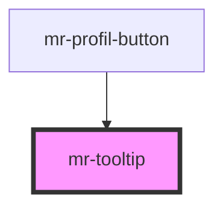

# mr-tooltip

<!-- Auto Generated Below -->

## Properties

| Property   | Attribute  | Description | Type     | Default     |
| ---------- | ---------- | ----------- | -------- | ----------- |
| `position` | `position` |             | `string` | `"bottom"`  |
| `shortcut` | `shortcut` |             | `string` | `undefined` |
| `text`     | `text`     |             | `string` | `undefined` |

## Dependencies

### Used by

 - [mr-profil-button](../mb-profil-button)

### Graph

----------------------------------------------

*Built with [StencilJS](https://stenciljs.com/)*
